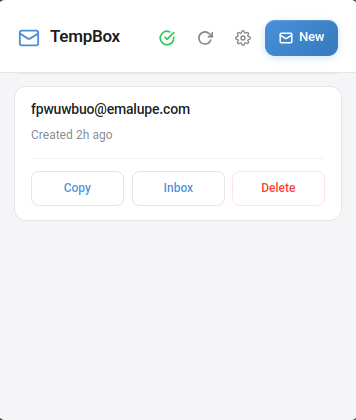
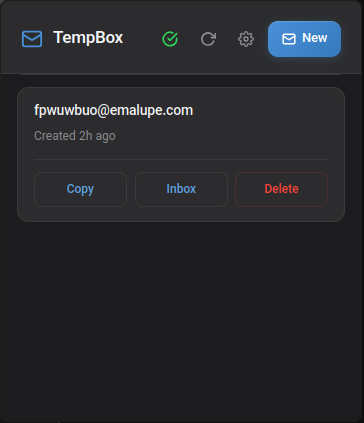
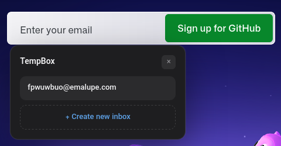
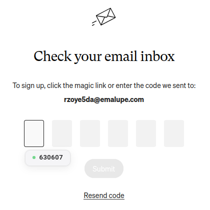

# TempBox
Temporary email addresses that appear when you need them.

## What it does
- Creates disposable email inboxes instantly via mail.tm.
- Injects a button into email fields on any website — click to fill with a temp address.
- Auto-detects OTP/verification codes from incoming emails and shows a clickable chip next to the code input.

## Install in Chrome/Brave (Chromium-based browsers)
1. Download `tempbox.zip` and unzip it.
2. Open Chrome and go to `chrome://extensions/` / `brave://extensions/`.
3. Enable `Developer mode` in the top right.
4. Click on `Load unpacked` and select the `tempbox` folder.
5. Done.

## Install in Firefox
1. Download `tempbox.xpi`
2. Open Firefox and go to `about:config`.
3. Search for `xpinstall.signatures.required` and change it to false.
4. Go to `about:addons`.
5. Click on `Settings` and select `Install from File`.
6. Select the `tempbox.xpi` file.
7. Done.

